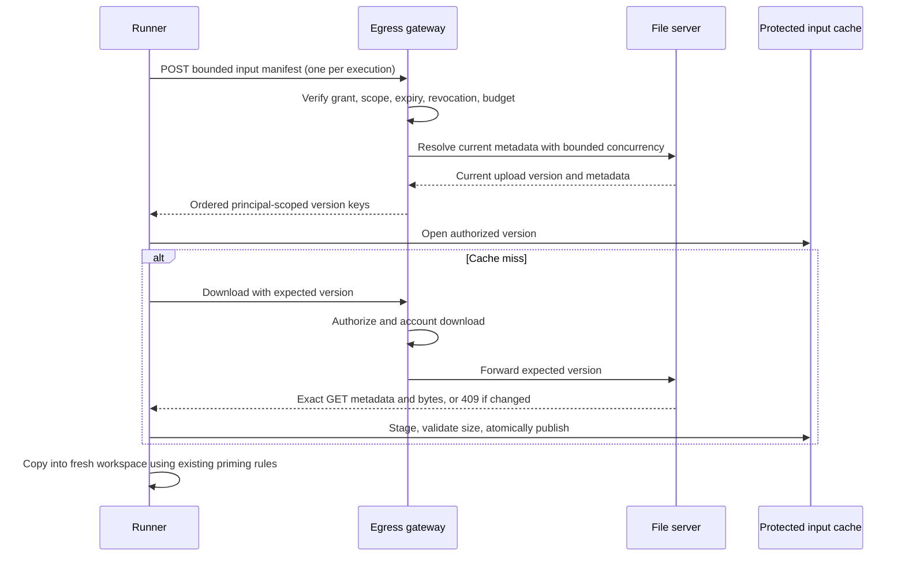

# Bounded input reuse for stateless executions

Fresh execution workspaces can reuse input contents without retaining a mutable conversation sandbox. Each reader first authorizes a metadata request through the egress gateway. New file-server uploads carry a random `codeapi-version` metadata value that changes on every PUT, including overwrites with identical contents. The gateway binds a cache key to that version, storage identity, tenant, user, size, filename, and read-only flag.



## Invariants

- A cache hit never authorizes an input. Every execution performs its own preflight, including readers joining a shared fill. Denied or revoked grants cannot use cached data.
- Every manifest handle is scope-checked before storage access. Revocation is checked again before returning resolved metadata. A deadline and disconnect cancel storage work; failures and older gateways fall back to independently authorized per-file preflights. A version-race retry discards its manifest entry.
- HTTP entries are marked separately from pushed inputs. Supplying an HTTP key in `input_cache_key` cannot bypass preflight through the older pushed-cache path.
- Cache files stay outside execution workspaces and sandbox mounts. Priming copies bytes; it never hard-links a writable workspace to trusted cache contents. Existing no-follow, read-only, hashing, atomic rename, and descriptor-pinning behavior remains in use.
- Concurrent authorized misses for the same version can share one download. Cancelling one reader does not cancel remaining readers; cancelling the last reader aborts the shared request. The number of fills, cached bytes, and object count are bounded.
- The downloader checks the version from the **actual GET**, rather than labeling bytes with metadata from an earlier HEAD. A raced overwrite returns 409 and preparation retries from current metadata. Legacy objects without a version use the uncached path.
- All writers of input objects must assign a fresh version on every overwrite. The file server does so for both upload routes. Checkpoint storage uses a separate path. Direct bucket writes that preserve an old version marker are outside this protocol.
- The optional Redis object-key index stores only a locator hint. It is not an authorization or metadata cache. Preflights still read current storage metadata; indexed keys must match the exact session and object identity.
- Shared download errors belong to the initiating grant. A coalesced caller falls back to its own authorized download rather than inheriting that grant's denial or exhausted budget.
- Redis reconnects never replay unfulfilled ledger mutations. A lost reply fails closed and may leave a conservatively charged counter/reservation until grant expiry; automatically refunding an ambiguous mutation could over-credit its budget.
- Full grant policy is no longer returned to the gateway for each authorization check. Atomic Redis scripts serialize accounting with revocation. Duplicate releases cannot repeatedly refund unrelated counters. Newly created compact ledgers keep immutable policy separate from mutable counters.

## Configuration

| Helm value | Environment variable | Default |
|---|---|---|
| `egressGrant.ledgerCompact` | `CODEAPI_EGRESS_LEDGER_COMPACT` | `false` |
| `egressGrant.inputManifestMaxFiles` | `CODEAPI_INPUT_MANIFEST_MAX_FILES` | `512` |
| `egressGrant.inputManifestConcurrency` | `CODEAPI_INPUT_MANIFEST_CONCURRENCY` | `8` |
| `egressGrant.inputManifestTimeoutMs` | `CODEAPI_INPUT_MANIFEST_TIMEOUT_MS` | `10000` |
| `fileServer.objectIndexEnabled` | `CODEAPI_FILE_OBJECT_INDEX_ENABLED` | `false` |
| `fileServer.metadataConcurrency` | `CODEAPI_FILE_METADATA_CONCURRENCY` | `1` |
| `workerSandbox.sandbox.httpInputCacheEnabled` | `SANDBOX_HTTP_INPUT_CACHE_ENABLED` | `true` |
| `workerSandbox.sandbox.httpInputCacheMaxInflight` | `SANDBOX_HTTP_INPUT_CACHE_MAX_INFLIGHT` | `16` |
| `workerSandbox.sandbox.httpInputCacheMaxObjects` | `SANDBOX_HTTP_INPUT_CACHE_MAX_OBJECTS` | `4096` |
| `workerSandbox.sandbox.inputCacheMaxBytes` | `SANDBOX_INPUT_CACHE_MAX_BYTES` | `536870912` |

HTTP reuse requires a configured egress gateway. Cacheable objects are also bounded by the existing runner maximum file size. Cache capacity is local to each runner; eviction, restart, or routing to another runner causes a safe cache miss. The cache does not require persistent-session affinity.

The manifest accepts at most 512 entries and a 4 MiB JSON body (protocol safety ceilings), with configured concurrency capped at 64. The runner bounds its opportunistic manifest request to 10 seconds, matching directory preparation, then uses per-file authorization if it cannot obtain a complete response. Oversized batches also fall back. Manifest requests remove repeated grant-header transfer and decoding, but still read current storage metadata for each file.

Metadata listing concurrency preserves order and is capped at 64. A canary can use 8 after measuring storage load. This applies to directory-marker preparation as well; marker listings still happen and are not a retained conversation manifest.

## Rollout and rollback

1. Deploy the new binaries with HTTP input reuse enabled by default. Mixed-version requests remain compatible: older gateways and relays fall back to normal downloads, while older unversioned objects return `cacheable: false`. The new file server stamps future uploads with versions. Set `workerSandbox.sandbox.httpInputCacheEnabled=false` only when a staged rollout requires the immediate rollback path.
2. Update **all** egress-gateway replicas before enabling compact ledgers. New binaries read both formats regardless of the creation flag. Older binaries cannot read compact hashes. To roll back to an older binary, disable compact creation, drain active grants, and wait their maximum TTL plus grace; never delete active ledgers to force a rollback.
3. Update all file-server writers before enabling the object-key index. Otherwise an older writer can change a locator without updating the index. Keep file-server replicas consistent during an indexed rollout.
4. Canary the default-on HTTP reuse path after updating the gateway, relay, runner, and launcher. Keep the feature explicitly disabled for storage adapters that cannot return user metadata on GET.
5. Observe `codeapi_sandbox_http_input_cache_events_total` (bounded event labels, no identities), cold and warm preparation latency, storage/Redis operations, admission fairness, request budgets, and memory/disk pressure before widening the rollout. A successful manifest consumes one read request for the batch, matching the existing list-request accounting unit. Per-file compatibility preflights each consume a read request; each cold miss consumes an additional download request. Do not disable budget enforcement to accommodate a workload.
6. Disable HTTP reuse to return to normal downloads immediately. Cached files can age out normally; no workspace deletion or migration is needed.

HTTP input reuse defaults on. Compact-ledger creation and the object-key index remain off until their mixed-version rollout requirements are satisfied. No object retention policy is changed by this code. Command grouping and persistent sessions remain independent options, not prerequisites for content reuse. Nothing deletes user inputs or infers shell dependencies.

## Validation

Ledger tests use an isolated real `redis-server` on a Unix socket with persistence disabled. Install Redis before running service tests. They cover legacy/compact formats, 240 concurrent reads against a strict budget, revocation, expiry, rejected uploads, duplicate releases, and format changes without resetting state.

Focused commands:

```sh
cd api
bun test src/input-manifest.test.ts src/http-input-cache.test.ts src/session-inputs.test.ts src/session-inputs.prime.test.ts src/download.test.ts src/inline-prime-atomicity.test.ts src/job-cleanup.test.ts
npx tsc --noEmit
```

```sh
cd service
bun test src/egress-ledger.test.ts src/egress-ledger-reconnect.test.ts src/egress-gateway.test.ts src/file-object-resolver.test.ts src/file-download.test.ts src/file-metadata.test.ts
npx tsc --noEmit
```

Run the code-package tests with Node (its supported test runner), plus launcher and deployment checks in CI. Cache regressions cover fresh-workspace reuse, cross-principal/version separation, denied preflights, pushed-key bypass prevention, coalesced cancellation, changed or oversized responses, and descriptor-safe eviction. Production latency targets must be validated with real regional storage latency and workload sizes; local synthetic results are not a production SLO.
